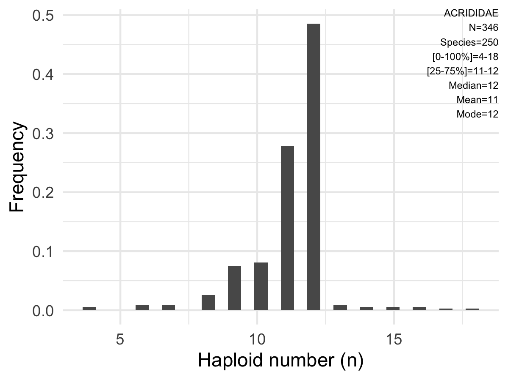

[Home](/ACC)

Histograms summarizing chromosomal counts (i.e., distribution of haploid counts, N) by taxonomic level can be found below. To select target lineage, type taxonomic information or select using drop-down menu.

#### Note: Haploid counts are based on inferred N (2N/2) with decimal numbers rounded up.

### Kingdom

Distribution of haploid numbers for *Animals*.  

<!--html_preserve-->
<html>
<select id="hbyNOJN5Zd" class="selectpicker" data-dropdown-align-right="false" data-dropup-auto="true" data-header="false" data-live-search="true" data-live-search-style="contains" data-show-tick="true" data-width="false" data-size="auto"><option value="plots/Animalia_kingdom.png">Animalia</option></select>

</html>

<!--/html_preserve-->

### Phylum
Distribution of haploid numbers for different Animal *phyla*.  

<!--html_preserve-->
<html>
<select id="KO8pis05sD" class="selectpicker" data-dropdown-align-right="false" data-dropup-auto="true" data-header="false" data-live-search="true" data-live-search-style="contains" data-show-tick="true" data-width="false" data-size="auto"><option value="plots/Annelida_phylum.png">Annelida</option>
<option value="plots/Arthropoda_phylum.png">Arthropoda</option>
<option value="plots/Chordata_phylum.png">Chordata</option>
<option value="plots/Cnidaria_phylum.png">Cnidaria</option>
<option value="plots/Echinodermata_phylum.png">Echinodermata</option>
<option value="plots/Mollusca_phylum.png">Mollusca</option>
<option value="plots/Nematoda_phylum.png">Nematoda</option>
<option value="plots/Nemertea_phylum.png">Nemertea</option>
<option value="plots/Platyhelminthes_phylum.png">Platyhelminthes</option>
<option value="plots/Rotifera_phylum.png">Rotifera</option>
<option value="plots/Xenacoelomorpha_phylum.png">Xenacoelomorpha</option></select>

</html>

<!--/html_preserve-->

### Class
Distribution of haploid numbers for different Animal *classes*.  

<!--html_preserve-->
<html>
<select id="cV4Ec3QpCl" class="selectpicker" data-dropdown-align-right="false" data-dropup-auto="true" data-header="false" data-live-search="true" data-live-search-style="contains" data-show-tick="true" data-width="false" data-size="auto"><option value="plots/Acoela_class.png">Acoela</option>
<option value="plots/Actinopterygii_class.png">Actinopterygii</option>
<option value="plots/Amphibia_class.png">Amphibia</option>
<option value="plots/Arachnida_class.png">Arachnida</option>
<option value="plots/Aves_class.png">Aves</option>
<option value="plots/Bivalvia_class.png">Bivalvia</option>
<option value="plots/Branchiopoda_class.png">Branchiopoda</option>
<option value="plots/Cestoda_class.png">Cestoda</option>
<option value="plots/Chilopoda_class.png">Chilopoda</option>
<option value="plots/Clitellata_class.png">Clitellata</option>
<option value="plots/Echinoidea_class.png">Echinoidea</option>
<option value="plots/Elasmobranchii_class.png">Elasmobranchii</option>
<option value="plots/Eurotatoria_class.png">Eurotatoria</option>
<option value="plots/Gastropoda_class.png">Gastropoda</option>
<option value="plots/Hexanauplia_class.png">Hexanauplia</option>
<option value="plots/Hydrozoa_class.png">Hydrozoa</option>
<option value="plots/Insecta_class.png">Insecta</option>
<option value="plots/Malacostraca_class.png">Malacostraca</option>
<option value="plots/Mammalia_class.png">Mammalia</option>
<option value="plots/Maxillopoda_class.png">Maxillopoda</option>
<option value="plots/Polychaeta_class.png">Polychaeta</option>
<option value="plots/Reptilia_class.png">Reptilia</option>
<option value="plots/Rhabditophora_class.png">Rhabditophora</option>
<option value="plots/Secernentea_class.png">Secernentea</option>
<option value="plots/Trematoda_class.png">Trematoda</option></select>

</html>

<!--/html_preserve-->

### Order
Distribution of haploid numbers for different Animal *orders*.  

<!--html_preserve-->
<html>
<select id="oK6w4FdT3D" class="selectpicker" data-dropdown-align-right="false" data-dropup-auto="true" data-header="false" data-live-search="true" data-live-search-style="contains" data-show-tick="true" data-width="false" data-size="auto"><option value="plots/	Catenulida _order.png">	Catenulida </option>
<option value="plots/Acoela_order.png">Acoela</option>
<option value="plots/Anura_order.png">Anura</option>
<option value="plots/Araneae_order.png">Araneae</option>
<option value="plots/Artiodactyla_order.png">Artiodactyla</option>
<option value="plots/Ascaridida_order.png">Ascaridida</option>
<option value="plots/Blattodea_order.png">Blattodea</option>
<option value="plots/Camarodonta_order.png">Camarodonta</option>
<option value="plots/Carcharhiniformes_order.png">Carcharhiniformes</option>
<option value="plots/Carnivora_order.png">Carnivora</option>
<option value="plots/Caudata_order.png">Caudata</option>
<option value="plots/Characiformes_order.png">Characiformes</option>
<option value="plots/Chiroptera_order.png">Chiroptera</option>
<option value="plots/Cingulata_order.png">Cingulata</option>
<option value="plots/Coleoptera_order.png">Coleoptera</option>
<option value="plots/Crassiclitellata_order.png">Crassiclitellata</option>
<option value="plots/Cyclophyllidea_order.png">Cyclophyllidea</option>
<option value="plots/Cyclopoida_order.png">Cyclopoida</option>
<option value="plots/Cypriniformes_order.png">Cypriniformes</option>
<option value="plots/Decapoda_order.png">Decapoda</option>
<option value="plots/Dermaptera_order.png">Dermaptera</option>
<option value="plots/Diptera_order.png">Diptera</option>
<option value="plots/Galliformes_order.png">Galliformes</option>
<option value="plots/Hemiptera_order.png">Hemiptera</option>
<option value="plots/Hymenoptera_order.png">Hymenoptera</option>
<option value="plots/Isopoda_order.png">Isopoda</option>
<option value="plots/Lagomorpha_order.png">Lagomorpha</option>
<option value="plots/Lepidoptera_order.png">Lepidoptera</option>
<option value="plots/Littorinimorpha_order.png">Littorinimorpha</option>
<option value="plots/Mantodea_order.png">Mantodea</option>
<option value="plots/Mecoptera_order.png">Mecoptera</option>
<option value="plots/Monotremata_order.png">Monotremata</option>
<option value="plots/Odonata_order.png">Odonata</option>
<option value="plots/Orthoptera_order.png">Orthoptera</option>
<option value="plots/Osmeriformes_order.png">Osmeriformes</option>
<option value="plots/Passeriformes_order.png">Passeriformes</option>
<option value="plots/Pedunculata_order.png">Pedunculata</option>
<option value="plots/Perciformes_order.png">Perciformes</option>
<option value="plots/Perissodactyla_order.png">Perissodactyla</option>
<option value="plots/Phasmida_order.png">Phasmida</option>
<option value="plots/Phyllodocida_order.png">Phyllodocida</option>
<option value="plots/Plagiorchiida_order.png">Plagiorchiida</option>
<option value="plots/Plecoptera_order.png">Plecoptera</option>
<option value="plots/Ploima_order.png">Ploima</option>
<option value="plots/Primates_order.png">Primates</option>
<option value="plots/Psittaciformes_order.png">Psittaciformes</option>
<option value="plots/Psocodea_order.png">Psocodea</option>
<option value="plots/Rheiformes_order.png">Rheiformes</option>
<option value="plots/Rodentia_order.png">Rodentia</option>
<option value="plots/Salmoniformes_order.png">Salmoniformes</option>
<option value="plots/Scorpiones_order.png">Scorpiones</option>
<option value="plots/Siluriformes_order.png">Siluriformes</option>
<option value="plots/Soricomorpha_order.png">Soricomorpha</option>
<option value="plots/Squamata_order.png">Squamata</option>
<option value="plots/Stylommatophora_order.png">Stylommatophora</option>
<option value="plots/Testudines_order.png">Testudines</option>
<option value="plots/Thysanoptera_order.png">Thysanoptera</option>
<option value="plots/Torpediniformes_order.png">Torpediniformes</option>
<option value="plots/Trichoptera_order.png">Trichoptera</option>
<option value="plots/Tricladida_order.png">Tricladida</option>
<option value="plots/Trombidiformes_order.png">Trombidiformes</option></select>

</html>

<!--/html_preserve-->

### Family
Distribution of haploid numbers for different Animal *families*.  

<!--html_preserve-->
<html>
<select id="gBNQywv40l" class="selectpicker" data-dropdown-align-right="false" data-dropup-auto="true" data-header="false" data-live-search="true" data-live-search-style="contains" data-show-tick="true" data-width="false" data-size="auto"><option value="plots/Acrididae_family.png">Acrididae</option>
<option value="plots/Agelenidae_family.png">Agelenidae</option>
<option value="plots/Aphididae_family.png">Aphididae</option>
<option value="plots/Aphrophoridae_family.png">Aphrophoridae</option>
<option value="plots/Apidae_family.png">Apidae</option>
<option value="plots/Ascarididae_family.png">Ascarididae</option>
<option value="plots/Bacillidae_family.png">Bacillidae</option>
<option value="plots/Blaberidae_family.png">Blaberidae</option>
<option value="plots/Bovidae_family.png">Bovidae</option>
<option value="plots/Braconidae_family.png">Braconidae</option>
<option value="plots/Buprestidae_family.png">Buprestidae</option>
<option value="plots/Callichthyidae_family.png">Callichthyidae</option>
<option value="plots/Canidae_family.png">Canidae</option>
<option value="plots/Carabidae_family.png">Carabidae</option>
<option value="plots/Catenulidae_family.png">Catenulidae</option>
<option value="plots/Cecidomyiidae_family.png">Cecidomyiidae</option>
<option value="plots/Cerambycidae_family.png">Cerambycidae</option>
<option value="plots/Chrysomelidae_family.png">Chrysomelidae</option>
<option value="plots/Coreidae_family.png">Coreidae</option>
<option value="plots/Corvidae_family.png">Corvidae</option>
<option value="plots/Crabronidae_family.png">Crabronidae</option>
<option value="plots/Cricetidae_family.png">Cricetidae</option>
<option value="plots/Curculionidae_family.png">Curculionidae</option>
<option value="plots/Cyclopidae_family.png">Cyclopidae</option>
<option value="plots/Cyprinidae_family.png">Cyprinidae</option>
<option value="plots/Dasypodidae_family.png">Dasypodidae</option>
<option value="plots/Diapheromeridae_family.png">Diapheromeridae</option>
<option value="plots/Dytiscidae_family.png">Dytiscidae</option>
<option value="plots/Echimyidae_family.png">Echimyidae</option>
<option value="plots/Ectobiidae_family.png">Ectobiidae</option>
<option value="plots/Elateridae_family.png">Elateridae</option>
<option value="plots/Erebidae_family.png">Erebidae</option>
<option value="plots/Eriococcidae_family.png">Eriococcidae</option>
<option value="plots/Eumenidae_family.png">Eumenidae</option>
<option value="plots/Euscorpiidae_family.png">Euscorpiidae</option>
<option value="plots/Formicidae_family.png">Formicidae</option>
<option value="plots/Gekkonidae_family.png">Gekkonidae</option>
<option value="plots/Geometridae_family.png">Geometridae</option>
<option value="plots/Geomyidae_family.png">Geomyidae</option>
<option value="plots/Gryllidae_family.png">Gryllidae</option>
<option value="plots/Halictidae_family.png">Halictidae</option>
<option value="plots/Helicidae_family.png">Helicidae</option>
<option value="plots/Hesperiidae_family.png">Hesperiidae</option>
<option value="plots/Heteromyidae_family.png">Heteromyidae</option>
<option value="plots/Ichneumonidae_family.png">Ichneumonidae</option>
<option value="plots/Kalotermitidae_family.png">Kalotermitidae</option>
<option value="plots/Lacertidae_family.png">Lacertidae</option>
<option value="plots/Lumbricidae_family.png">Lumbricidae</option>
<option value="plots/Lycaenidae_family.png">Lycaenidae</option>
<option value="plots/Mecynostomidae_family.png">Mecynostomidae</option>
<option value="plots/Menippidae_family.png">Menippidae</option>
<option value="plots/Muridae_family.png">Muridae</option>
<option value="plots/Muscicapidae_family.png">Muscicapidae</option>
<option value="plots/Notodontidae_family.png">Notodontidae</option>
<option value="plots/Nymphalidae_family.png">Nymphalidae</option>
<option value="plots/Ornithorhynchidae_family.png">Ornithorhynchidae</option>
<option value="plots/Passalidae_family.png">Passalidae</option>
<option value="plots/Passeridae_family.png">Passeridae</option>
<option value="plots/Phasianidae_family.png">Phasianidae</option>
<option value="plots/Phasmatidae_family.png">Phasmatidae</option>
<option value="plots/Phrynosomatidae_family.png">Phrynosomatidae</option>
<option value="plots/Phyllostomidae_family.png">Phyllostomidae</option>
<option value="plots/Pieridae_family.png">Pieridae</option>
<option value="plots/Planariidae_family.png">Planariidae</option>
<option value="plots/Psittacidae_family.png">Psittacidae</option>
<option value="plots/Reduviidae_family.png">Reduviidae</option>
<option value="plots/Rheidae_family.png">Rheidae</option>
<option value="plots/Salmonidae_family.png">Salmonidae</option>
<option value="plots/Sciuridae_family.png">Sciuridae</option>
<option value="plots/Scyliorhinidae_family.png">Scyliorhinidae</option>
<option value="plots/Soricidae_family.png">Soricidae</option>
<option value="plots/Staphylinidae_family.png">Staphylinidae</option>
<option value="plots/Stenostomidae_family.png">Stenostomidae</option>
<option value="plots/Teiidae_family.png">Teiidae</option>
<option value="plots/Tenebrionidae_family.png">Tenebrionidae</option>
<option value="plots/Tenthredinidae_family.png">Tenthredinidae</option>
<option value="plots/Tettigoniidae_family.png">Tettigoniidae</option>
<option value="plots/Thripidae_family.png">Thripidae</option>
<option value="plots/Torpedinidae_family.png">Torpedinidae</option>
<option value="plots/Toxopneustidae_family.png">Toxopneustidae</option>
<option value="plots/Vespertilionidae_family.png">Vespertilionidae</option>
<option value="plots/Vespidae_family.png">Vespidae</option></select>

</html>

<!--/html_preserve-->

### Genus
Distribution of haploid numbers for different Animal *genera*.  

<!--html_preserve-->
<html>
<select id="zN7URqBgIk" class="selectpicker" data-dropdown-align-right="false" data-dropup-auto="true" data-header="false" data-live-search="true" data-live-search-style="contains" data-show-tick="true" data-width="false" data-size="auto"><option value="plots/Agrodiaetus_genus.png">Agrodiaetus</option>
<option value="plots/Amara_genus.png">Amara</option>
<option value="plots/Aphaenogaster_genus.png">Aphaenogaster</option>
<option value="plots/Apiomorpha_genus.png">Apiomorpha</option>
<option value="plots/Camponotus_genus.png">Camponotus</option>
<option value="plots/Catenula_genus.png">Catenula</option>
<option value="plots/Chrysolina_genus.png">Chrysolina</option>
<option value="plots/Cordia_genus.png">Cordia</option>
<option value="plots/Corydoras_genus.png">Corydoras</option>
<option value="plots/Crocidura_genus.png">Crocidura</option>
<option value="plots/Dipodomys_genus.png">Dipodomys</option>
<option value="plots/Dytiscus_genus.png">Dytiscus</option>
<option value="plots/Erebia_genus.png">Erebia</option>
<option value="plots/Euscorpius_genus.png">Euscorpius</option>
<option value="plots/Galeus_genus.png">Galeus</option>
<option value="plots/Lacerta_genus.png">Lacerta</option>
<option value="plots/Lasioglossum_genus.png">Lasioglossum</option>
<option value="plots/Leptogenys_genus.png">Leptogenys</option>
<option value="plots/Leptothorax_genus.png">Leptothorax</option>
<option value="plots/Lycia_genus.png">Lycia</option>
<option value="plots/Menippe_genus.png">Menippe</option>
<option value="plots/Microtus_genus.png">Microtus</option>
<option value="plots/Monomorium_genus.png">Monomorium</option>
<option value="plots/Mus_genus.png">Mus</option>
<option value="plots/Myrmecia_genus.png">Myrmecia</option>
<option value="plots/Ornithorhynchus_genus.png">Ornithorhynchus</option>
<option value="plots/Otiorrhynchus_genus.png">Otiorrhynchus</option>
<option value="plots/Pachycondyla_genus.png">Pachycondyla</option>
<option value="plots/Paramecynostomum_genus.png">Paramecynostomum</option>
<option value="plots/Passer_genus.png">Passer</option>
<option value="plots/Phasianus_genus.png">Phasianus</option>
<option value="plots/Polistes_genus.png">Polistes</option>
<option value="plots/Polyommatus_genus.png">Polyommatus</option>
<option value="plots/Proechimys_genus.png">Proechimys</option>
<option value="plots/Rhea_genus.png">Rhea</option>
<option value="plots/Rhytidoponera_genus.png">Rhytidoponera</option>
<option value="plots/Scyliorhinus_genus.png">Scyliorhinus</option>
<option value="plots/Sorex_genus.png">Sorex</option>
<option value="plots/Stenostomum_genus.png">Stenostomum</option>
<option value="plots/Temnothorax_genus.png">Temnothorax</option>
<option value="plots/Tenthredo_genus.png">Tenthredo</option>
<option value="plots/Thomomys_genus.png">Thomomys</option>
<option value="plots/Torpedo_genus.png">Torpedo</option>
<option value="plots/Toxocara_genus.png">Toxocara</option>
<option value="plots/Turdus_genus.png">Turdus</option></select>

</html>

<!--/html_preserve-->
  

[Home](/ACC)

