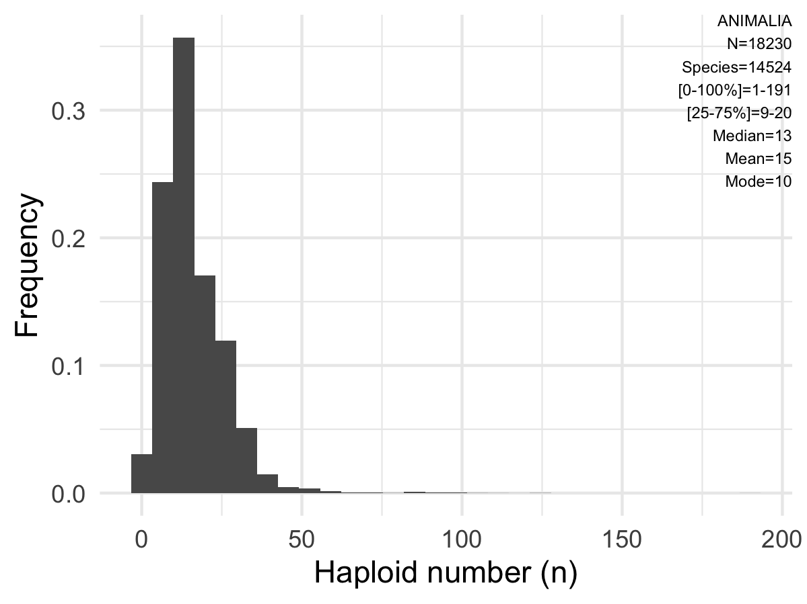

Data from the **ACC** can be easily downloaded from this website. The dataset can be filtered by taxonomic names or haploid/diploid counts. Multiple filters can be applied simultaneously to the database.

### Kingdom
<!--html_preserve-->
<html>
<select id="pEx86AAHdU" class="selectpicker" data-dropdown-align-right="false" data-dropup-auto="true" data-header="false" data-live-search="true" data-live-search-style="contains" data-show-tick="true" data-width="false" data-size="auto"><option value="plots/Animalia_kingdom.png">Animalia</option></select>

</html>

<!--/html_preserve-->

### Phylum
<!--html_preserve-->
<html>
<select id="zH0tJdRTkn" class="selectpicker" data-dropdown-align-right="false" data-dropup-auto="true" data-header="false" data-live-search="true" data-live-search-style="contains" data-show-tick="true" data-width="false" data-size="auto"><option value="plots/Annelida_phylum.png">Annelida</option>
<option value="plots/Arthropoda_phylum.png">Arthropoda</option>
<option value="plots/Chordata_phylum.png">Chordata</option>
<option value="plots/Echinodermata_phylum.png">Echinodermata</option>
<option value="plots/Mollusca_phylum.png">Mollusca</option>
<option value="plots/Platyhelminthes_phylum.png">Platyhelminthes</option></select>

</html>

<!--/html_preserve-->

### Class
<!--html_preserve-->
<html>
<select id="uqfrJc1Zcw" class="selectpicker" data-dropdown-align-right="false" data-dropup-auto="true" data-header="false" data-live-search="true" data-live-search-style="contains" data-show-tick="true" data-width="false" data-size="auto"><option value="plots/Actinopterygii_class.png">Actinopterygii</option>
<option value="plots/Amphibia_class.png">Amphibia</option>
<option value="plots/Arachnida_class.png">Arachnida</option>
<option value="plots/Aves_class.png">Aves</option>
<option value="plots/Clitellata_class.png">Clitellata</option>
<option value="plots/Elasmobranchii_class.png">Elasmobranchii</option>
<option value="plots/Gastropoda_class.png">Gastropoda</option>
<option value="plots/Insecta_class.png">Insecta</option>
<option value="plots/Malacostraca_class.png">Malacostraca</option>
<option value="plots/Mammalia_class.png">Mammalia</option>
<option value="plots/Reptilia_class.png">Reptilia</option></select>

</html>

<!--/html_preserve-->

### Order
<!--html_preserve-->
<html>
<select id="6TYOjar2O9" class="selectpicker" data-dropdown-align-right="false" data-dropup-auto="true" data-header="false" data-live-search="true" data-live-search-style="contains" data-show-tick="true" data-width="false" data-size="auto"><option value="plots/Anura_order.png">Anura</option>
<option value="plots/Araneae_order.png">Araneae</option>
<option value="plots/Artiodactyla_order.png">Artiodactyla</option>
<option value="plots/Ascaridida_order.png">Ascaridida</option>
<option value="plots/Blattodea_order.png">Blattodea</option>
<option value="plots/Carcharhiniformes_order.png">Carcharhiniformes</option>
<option value="plots/Carnivora_order.png">Carnivora</option>
<option value="plots/Chiroptera_order.png">Chiroptera</option>
<option value="plots/Coleoptera_order.png">Coleoptera</option>
<option value="plots/Decapoda_order.png">Decapoda</option>
<option value="plots/Hemiptera_order.png">Hemiptera</option>
<option value="plots/Hymenoptera_order.png">Hymenoptera</option>
<option value="plots/Isopoda_order.png">Isopoda</option>
<option value="plots/Lepidoptera_order.png">Lepidoptera</option>
<option value="plots/Passeriformes_order.png">Passeriformes</option>
<option value="plots/Phasmida_order.png">Phasmida</option>
<option value="plots/Rodentia_order.png">Rodentia</option>
<option value="plots/Scorpiones_order.png">Scorpiones</option>
<option value="plots/Siluriformes_order.png">Siluriformes</option>
<option value="plots/Soricomorpha_order.png">Soricomorpha</option>
<option value="plots/Squamata_order.png">Squamata</option>
<option value="plots/Thysanoptera_order.png">Thysanoptera</option>
<option value="plots/Torpediniformes_order.png">Torpediniformes</option></select>

</html>

<!--/html_preserve-->

### Family
<!--html_preserve-->
<html>
<select id="rxA8vf5Gmd" class="selectpicker" data-dropdown-align-right="false" data-dropup-auto="true" data-header="false" data-live-search="true" data-live-search-style="contains" data-show-tick="true" data-width="false" data-size="auto"><option value="plots/Apidae_family.png">Apidae</option>
<option value="plots/Carabidae_family.png">Carabidae</option>
<option value="plots/Chrysomelidae_family.png">Chrysomelidae</option>
<option value="plots/Cricetidae_family.png">Cricetidae</option>
<option value="plots/Curculionidae_family.png">Curculionidae</option>
<option value="plots/Dytiscidae_family.png">Dytiscidae</option>
<option value="plots/Eriococcidae_family.png">Eriococcidae</option>
<option value="plots/Eumenidae_family.png">Eumenidae</option>
<option value="plots/Formicidae_family.png">Formicidae</option>
<option value="plots/Geometridae_family.png">Geometridae</option>
<option value="plots/Geomyidae_family.png">Geomyidae</option>
<option value="plots/Heteromyidae_family.png">Heteromyidae</option>
<option value="plots/Lycaenidae_family.png">Lycaenidae</option>
<option value="plots/Muridae_family.png">Muridae</option>
<option value="plots/Nymphalidae_family.png">Nymphalidae</option>
<option value="plots/Scyliorhinidae_family.png">Scyliorhinidae</option>
<option value="plots/Soricidae_family.png">Soricidae</option>
<option value="plots/Thripidae_family.png">Thripidae</option>
<option value="plots/Torpedinidae_family.png">Torpedinidae</option></select>

</html>

<!--/html_preserve-->

### Genus
<!--html_preserve-->
<html>
<select id="Zk0fNqJfBv" class="selectpicker" data-dropdown-align-right="false" data-dropup-auto="true" data-header="false" data-live-search="true" data-live-search-style="contains" data-show-tick="true" data-width="false" data-size="auto"><option value="plots/Agrodiaetus_genus.png">Agrodiaetus</option>
<option value="plots/Apiomorpha_genus.png">Apiomorpha</option>
<option value="plots/Galeus_genus.png">Galeus</option>
<option value="plots/Myrmecia_genus.png">Myrmecia</option>
<option value="plots/Pachycondyla_genus.png">Pachycondyla</option>
<option value="plots/Polistes_genus.png">Polistes</option>
<option value="plots/Scyliorhinus_genus.png">Scyliorhinus</option>
<option value="plots/Torpedo_genus.png">Torpedo</option></select>

</html>

<!--/html_preserve-->

